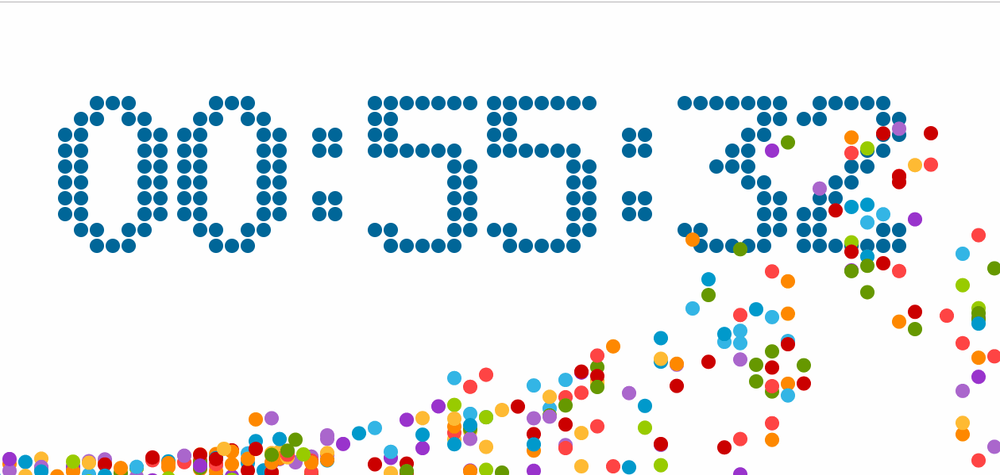

# Demo
some interested demo  

------

## 炫酷计时器
* canvas绘制基本界面
* 距当前时间2小时倒计时
* 数字变化时迸出彩色小球，随机下落碰撞滚动 
 
**展示:**

----
## FlappyBird
  * canvas绘制，加载图片资源
  * ES6语法编写，面向对象思路
  * 点击中间按钮，游戏开始  
    小鸟撞到天花板/地板/铅笔，游戏结束
  * 小鸟飞过一对铅笔加一分
  * 后期可移植到微信小游戏中，移植版见（flappyBird_app）
  
  **展示:**  
  
  
  ---